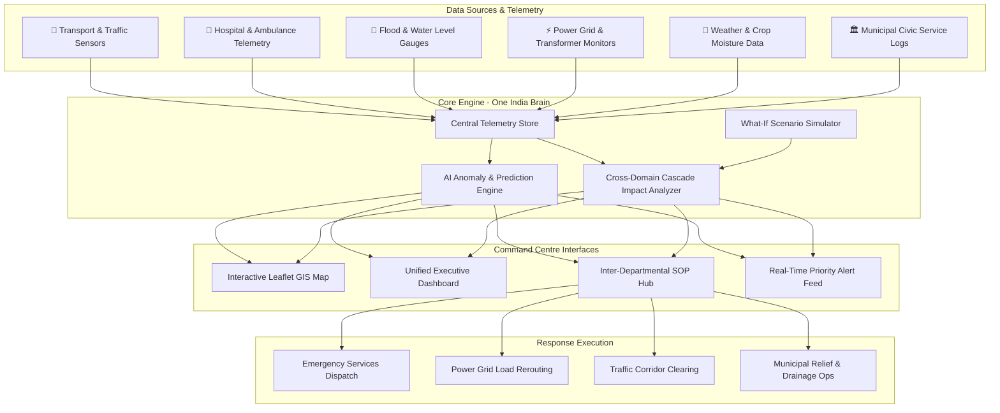

<div align="center">

# 🇮🇳 One India Brain
### *Unified AI-Powered Cross-Domain Command Centre & Smart Governance Decision Support System*

[](https://react.dev/)
[](https://vitejs.dev/)
[](https://tailwindcss.com/)
[](https://leafletjs.com/)
[](https://recharts.org/)
[](LICENSE)

</div>

---

## 🌟 Executive Overview

**One India Brain** is a next-generation **AI-powered cross-domain command centre** designed to unite fragmented municipal and state governance infrastructure into a single, cohesive, real-time intelligence hub.

In modern governance, critical urban sectors—**Transport, Healthcare, Disaster Management, Water, Power Grid, Agriculture, and Municipal Services**—often operate in isolated siloes. When a crisis occurs (e.g., a severe cyclone or power grid failure), the lack of cross-domain visibility delays emergency response and causes cascading domino effects across urban infrastructure.

**One India Brain** solves this challenge by:
1. **Aggregating Sensor Telemetry**: Ingesting real-time sensor streams across 8 critical governance domains.
2. **Predicting Cascading Impacts**: Using an intelligent **Cascade Impact Engine** to model how an incident in one sector triggers secondary failures in adjacent sectors.
3. **Automating Multi-Agency SOPs**: Delivering real-time, AI-driven Standard Operating Procedures (SOPs) for coordinated inter-departmental action.
4. **Interactive GIS Telemetry Map**: Providing a district-level interactive Leaflet map featuring real-time incident markers, risk zones, and sensor feeds.
5. **What-If Scenario Simulation**: Enabling command operators to simulate extreme events (e.g., flash floods, heatwaves, grid failures) and test response preparedness in real time.

---

## 🏛 Architecture & Data Flow



---

## ✨ Key Features & Domain Modules

### 🌐 1. Unified Command Centre Dashboard
* **Real-Time Situation Room**: Overview of active incidents, cross-domain risk score, and system health across all districts.
* **Live Incident Feed**: Chronological timeline of high-priority alerts with automated escalation status.
* **Interactive District GIS Map**: Custom Leaflet map with domain filter overlays, telemetry markers, and risk hotspots.

### ⚡ 2. Cross-Domain Cascade Analysis Engine
* **Domino Effect Modeling**: Detects how primary incidents propagate (e.g., Power Grid Failure → Water Treatment Shutdown → Hospital Backup Generator Dependency → Traffic Gridlock).
* **Quantified Vulnerability Index**: Real-time risk scoring for connected infrastructure.

### 📋 3. Standard Operating Procedure (SOP) Action Hub
* **Automated Action Recommendations**: Provides step-by-step SOPs assigned to specific departments (e.g., Disaster Management, Traffic Police, Health Ministry).
* **One-Click Execution**: Interactive status toggling (Pending → In Progress → Resolved) with real-time audit logging.

### 🧪 4. What-If Scenario Simulator
* **Stress Test Governance**: Simulate 100-year rainfalls, grid failures, heatwaves, or urban chemical spills.
* **Predictive Impact Analysis**: Instant preview of expected casualties, economic loss risk, and critical service downtime prior to event occurrence.

### 🏢 5. Sector-Specific Telemetry Dashboards

| Sector | Module Capabilities | Key Metrics Monitored |
| :--- | :--- | :--- |
| 🚑 **Healthcare** | ICU Bed Availability, Ambulance Tracking, Blood Bank Stock | Bed Occupancy, ER Wait Time, Oxygen Reserve |
| 🚗 **Transport** | Traffic Corridor Flow, Emergency Evacuation Routes | Congestion Index, Signal Health, Transit Delay |
| 🌊 **Water Supply** | Reservoir Levels, Pipeline Leak Detection, Pumping Stations | Storage Capacity, Flow Rate, Water Quality Index |
| ⚡ **Power Grid** | Substation Load, Transformer Thermal Sensors, Backup Power | Load Capacity, Frequency Stability, Outage Radius |
| 🌪 **Disaster Relief** | Evacuation Center Capacity, Relief Material Inventory | Storm Surge Level, Shelter Occupancy, Dispatch Count |
| 🌾 **Agriculture** | Crop Soil Moisture, Flood Submergence Warning | Drought Vulnerability, Reservoir Allocations |
| 🏙 **Municipal Services**| Civic Complaints, Waste Management, Drainage Clearance | Resolution Time, Sanitation Index, Pump Status |

---

## 🛠 Tech Stack

* **Frontend Framework**: [React 19](https://react.dev/) + [React Router v7](https://reactrouter.com/)
* **Build System**: [Vite 8](https://vitejs.dev/)
* **Styling**: [Tailwind CSS v4](https://tailwindcss.com/) + Custom Glassmorphic Dark Design System
* **Mapping & Spatial Analytics**: [Leaflet](https://leafletjs.com/) + [React Leaflet](https://react-leaflet.js.org/)
* **Data Visualization**: [Recharts](https://recharts.org/) (Multi-axis telemetry trends, radar risk charts, area graphs)
* **Icons & UI Assets**: [Lucide React](https://lucide.dev/)
* **Interactive Feedback**: Canvas Confetti, Custom Modal Dialogs, Responsive Sidebars

---

## 📂 Project Structure

```
one-india-brain/
├── public/                     # Static assets & brand logos
│   ├── favicon.svg
│   └── one-india-brain-logo.png
├── src/
│   ├── components/             # Reusable UI & Domain Components
│   │   ├── shared/             # Shared Map & Banner components
│   │   ├── layout/             # App Shell, Sidebar, Top Header
│   │   ├── CascadeAnalysis.jsx # Cascade Impact Graph & Diagnostics
│   │   ├── DepartmentSopHub.jsx# Inter-Departmental SOP Hub
│   │   ├── DomainMetricsGrid.jsx# Real-time Metric Cards
│   │   ├── MapViewer.jsx       # Main GIS Map Component
│   │   ├── SituationDecisionPanel.jsx # Action Room & Incident Response
│   │   └── WhatIfSimulator.jsx # Scenario Simulation Controls
│   ├── data/                   # Telemetry Data & Central Reactive Store
│   │   ├── centralStore.js     # State store for active incidents & metrics
│   │   ├── departmentActions.js# SOP Data and Response Workflows
│   │   ├── districts.js        # District GIS Coordinates & Sensor Metadata
│   │   ├── incidentData.js     # Incident definitions & cascade triggers
│   │   └── scenarios.js        # Simulation scenario presets
│   ├── pages/                  # Page Views for All 8 Domains & Controls
│   │   ├── DashboardPage.jsx   # Unified Command Centre
│   │   ├── TransportPage.jsx   # Transport & Traffic Control
│   │   ├── HealthcarePage.jsx  # Health & Emergency Response
│   │   ├── DisasterPage.jsx    # Disaster Management
│   │   ├── WaterPage.jsx       # Water Resources & Distribution
│   │   ├── ElectricityPage.jsx # Power Grid & Energy
│   │   ├── AgriculturePage.jsx # Agriculture & Soil Intelligence
│   │   ├── MunicipalPage.jsx   # Urban Municipal Services
│   │   ├── AiInsightsPage.jsx  # AI Anomaly & Risk Analytics
│   │   ├── SimulationPage.jsx  # What-If Scenario Sandbox
│   │   ├── AlertsPage.jsx      # System-wide Alert Stream
│   │   └── SettingsPage.jsx    # Threshold & System Config
│   ├── utils/
│   │   └── aiEngine.js         # Predictive AI & Cascade Analysis Logic
│   ├── App.jsx                 # Routing & Application Container
│   ├── index.css               # Core Design Tokens & Glassmorphism Utilities
│   └── main.jsx                # Application Entry Point
├── package.json
├── vite.config.js
└── README.md
```

---

## 🚀 Quick Start & Installation

### Prerequisites
* **Node.js**: `v18.0.0` or higher
* **npm**: `v9.0.0` or higher

### 1. Clone the Repository
```bash
git clone https://github.com/Gunjan0987/One-India-Brain.git
cd One-India-Brain
```

### 2. Install Dependencies
```bash
npm install
```

### 3. Run Development Server
```bash
npm run dev
```
Open your browser and navigate to `http://localhost:5173`.

### 4. Build for Production
```bash
npm run build
```
The optimized production bundle will be generated in the `dist/` directory.

---

## 🤝 Contributing

Contributions, feature suggestions, and security reporting are welcome! 

1. **Fork** the repository
2. Create your feature branch (`git checkout -b feature/SmartGridIntegration`)
3. Commit your changes (`git commit -m 'Add Smart Grid telemetry integration'`)
4. Push to the branch (`git push origin feature/SmartGridIntegration`)
5. Open a **Pull Request**

---

## 📄 License

This project is open source and available under the [MIT License](LICENSE).

---

<div align="center">

Developed with ❤️ by **[Gunjan Singh Adhikari](https://github.com/Gunjan0987)**  
*Empowering Smart Governance & Resilient Communities Across India 🇮🇳*

</div>
